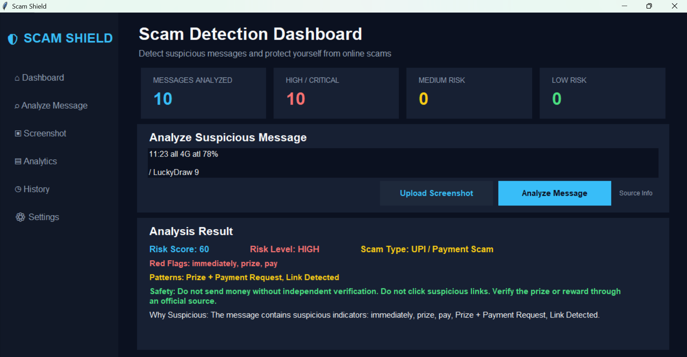

# ScamShield 🛡️

ScamShield is an explainable scam message analyzer built using Python and OCR. It analyzes suspicious messages, identifies potential scam patterns, calculates a risk score, classifies the scam type, and explains why a message may be suspicious.

## Features

* Scam message analysis
* Risk score calculation
* Risk level classification
* Scam type detection
* Explainable red-flag detection
* Safety recommendations
* Screenshot-based scam analysis using OCR
* Analysis history
* Tkinter-based graphical user interface
* CSV-based history storage

## Scam Types Detected

* UPI / Payment Scam
* Banking / KYC Scam
* Job / Recruitment Scam
* Prize / Reward Scam
* Delivery Scam
* Phishing Scam

## Risk Levels

* LOW
* MEDIUM
* HIGH
* CRITICAL

## How It Works

1. User enters a suspicious message or uploads a screenshot.
2. ScamShield extracts and cleans the message text.
3. The analyzer checks for suspicious patterns and red flags.
4. A risk score is calculated based on detected indicators.
5. The message is classified into a possible scam category.
6. The system explains why the message is considered suspicious.
7. Safety recommendations are provided to the user.
8. Analysis results can be stored in the history for further analysis.

## OCR Screenshot Analysis

ScamShield can analyze screenshots of suspicious messages using Optical Character Recognition (OCR).

The screenshot text is extracted using OCR and passed to the same scam detection engine for analysis.

## Tech Stack

* Python
* Object-Oriented Programming (OOP)
* Tkinter
* Pytesseract
* OCR
* Pandas
* CSV

## Screenshots

### Dashboard



### Scam Message Analysis


### OCR Screenshot Analysis


## Project Structure

```text
ScamShield/
│
├── Scam_shield.py
├── gui.py
├── screenshots/
│   ├── dashboard.png
│   ├── analysis.png
│   └── ocr.png
├── .gitignore
└── README.md
```

## Installation

Clone the repository:

```bash
git clone https://github.com/vijitkumar07/ScamShield.git
```

Move into the project directory:

```bash
cd ScamShield
```

Install the required Python packages:

```bash
pip install pillow pytesseract pandas
```

Make sure Tesseract OCR is installed and configured on your system.

## Run the Application

Run the graphical interface:

```bash
python gui.py
```

## Future Enhancements

* Power BI dashboard for scam risk analytics
* Advanced analytics using Pandas
* Visual analysis of scam patterns
* Improved scam classification
* Additional suspicious message patterns
* Enhanced OCR processing

## Purpose

ScamShield is designed as an educational and practical cybersecurity project to help users understand potentially suspicious messages and the common warning signs associated with online scams.

## Disclaimer

ScamShield is an educational project and should not be considered a replacement for professional cybersecurity or law-enforcement services. Users should independently verify suspicious messages, links, payment requests, and other potentially fraudulent communications.
