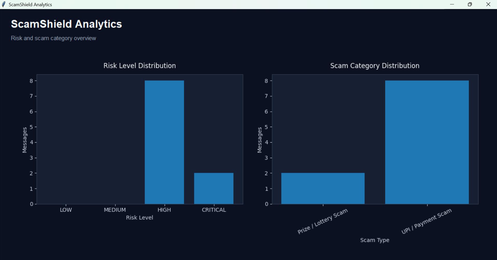
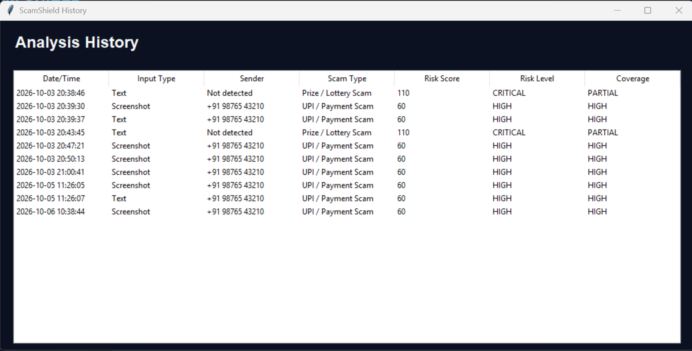

# 🛡️ ScamShield

**ScamShield** is an explainable scam-message analyzer built using **Python and Object-Oriented Programming (OOP)**. It analyzes suspicious messages, detects scam patterns, calculates a risk score, identifies the possible scam type, and explains why a message may be suspicious.

The application also supports **OCR-based screenshot analysis**, allowing users to upload a screenshot of a suspicious message and automatically extract its text for analysis.

---

## 🚀 Features

* 🔍 Scam message analysis
* ⚠️ Rule-based risk scoring
* 🧠 Explainable scam detection
* 📊 Risk levels: LOW, MEDIUM, HIGH, CRITICAL
* 🏷️ Scam-type classification
* 💳 UPI / Payment scam detection
* 🏦 Banking / KYC scam detection
* 💼 Job / Recruitment scam detection
* 🎁 Prize / Reward scam detection
* 📦 Delivery scam detection
* 🎣 Phishing detection
* 🔗 Suspicious link detection
* 🔐 OTP / PIN / payment request detection
* 📷 Screenshot analysis using OCR
* 📝 Automatic text extraction from screenshots
* 📜 Scam analysis history
* 🖥️ Desktop GUI using Tkinter
* 🌙 Dark-themed cybersecurity interface

---

## 🧠 How It Works

ScamShield follows a rule-based analysis workflow:

```text
User Message
     ↓
Text Cleaning
     ↓
Red Flag Detection
     ↓
Risk Score Calculation
     ↓
Scam Type Detection
     ↓
Risk Level
     ↓
Explanation
     ↓
Safety Recommendation
```

The analyzer checks for suspicious indicators such as:

* Urgent language
* Payment requests
* OTP requests
* Prize or reward claims
* Account threats
* Suspicious links
* Financial keywords
* Phishing patterns

---

## ⚠️ Risk Levels

| Risk Level      | Description                                        |
| --------------- | -------------------------------------------------- |
| 🟢 **LOW**      | Few or no suspicious indicators detected           |
| 🟡 **MEDIUM**   | Some suspicious patterns detected                  |
| 🟠 **HIGH**     | Multiple strong scam indicators detected           |
| 🔴 **CRITICAL** | Highly suspicious or potentially dangerous message |

---

## 🏷️ Scam Types

ScamShield can identify common scam categories including:

* **UPI / Payment Scam**
* **Banking / KYC Scam**
* **Job / Recruitment Scam**
* **Prize / Reward Scam**
* **Delivery Scam**
* **Phishing**

---

## 📷 Screenshot OCR Analysis

ScamShield can analyze screenshots containing suspicious messages using **Optical Character Recognition (OCR)**.

### Workflow

```text
Screenshot
    ↓
OCR Text Extraction
    ↓
Message Analyzer
    ↓
Risk Score
    ↓
Scam Type
    ↓
Explanation & Recommendation
```

This allows users to analyze suspicious messages from sources such as WhatsApp, SMS, email, or other messaging platforms without manually typing the message.

---

## 🖥️ Application Screenshots

### 📊 Dashboard

<p align="center">
  
</p>

### 🔍 Scam Analysis

<p align="center">
  
</p>

### 📷 Screenshot OCR Analysis

<p align="center">
  
</p>

---

## 🛠️ Tech Stack

| Technology              | Purpose                       |
| ----------------------- | ----------------------------- |
| **Python**              | Core application development  |
| **OOP**                 | Modular application structure |
| **Tkinter**             | Desktop GUI                   |
| **Pytesseract**         | OCR text extraction           |
| **Pillow (PIL)**        | Image processing              |
| **Regular Expressions** | Pattern detection             |
| **CSV**                 | Scam history storage          |
| **Git & GitHub**        | Version control               |

---

## 📂 Project Structure

```text
ScamShield/
│
├── Scam_shield.py
├── gui.py
├── README.md
├── .gitignore
│
└── screenshots/
    ├── dashboard.png
    ├── scam-analysis.png
    └── screenshot-ocr.png
```

---

## ⚙️ Installation

### 1. Clone the Repository

```bash
git clone https://github.com/vijitkumar07/ScamShield.git
```

### 2. Open the Project

```bash
cd ScamShield
```

### 3. Install Required Python Packages

```bash
pip install pillow pytesseract
```

### 4. Install Tesseract OCR

ScamShield uses **Tesseract OCR** to extract text from uploaded screenshots.

After installing Tesseract OCR, make sure the Tesseract installation path is correctly configured if required by your system.

---

## ▶️ Run the Application

Start the desktop application using:

```bash
python gui.py
```

The ScamShield GUI will open and allow you to analyze suspicious messages or screenshots.

---

## 🔎 Example

### Suspicious Message

```text
Congratulations! You won ₹50,000.
Pay ₹499 immediately to claim your prize.
Click here: http://example-link.com
```

### Detected Indicators

The analyzer may detect:

* 🎁 Prize / reward claim
* 💳 Payment request
* ⚠️ Urgent language
* 🔗 Suspicious HTTP link

Based on these indicators, ScamShield calculates a risk score and provides an explanation of why the message may be suspicious.

---

## 📊 Future Enhancements

* 📈 Power BI dashboard for scam-risk analytics
* 🐼 Advanced analytics using Pandas
* 📊 Visual analysis of scam patterns
* 🧠 Improved scam classification
* 🔍 Additional suspicious message patterns
* 📷 Enhanced OCR processing
* 📜 More detailed historical analytics
* 🤖 Machine-learning-based scam detection

---

## 🎯 Project Purpose

The goal of ScamShield is to demonstrate how **Python, OOP, rule-based analysis, GUI development, and OCR** can be combined to create a practical cybersecurity-focused application.

The project focuses on **explainable detection**, allowing users to understand not only that a message has been flagged, but also **which suspicious indicators caused the warning**.

---

## 👨‍💻 Author

**Vijit Kumar**

B.Tech – Computer Science & Engineering

**GitHub:**
https://github.com/vijitkumar07

---

## ⚠️ Disclaimer

ScamShield is an educational and demonstration project. Its results should not be considered a guaranteed determination that a message is fraudulent or legitimate.

Users should independently verify suspicious messages and should never share sensitive information such as **OTPs, PINs, passwords, banking credentials, or payment details** with untrusted sources.
